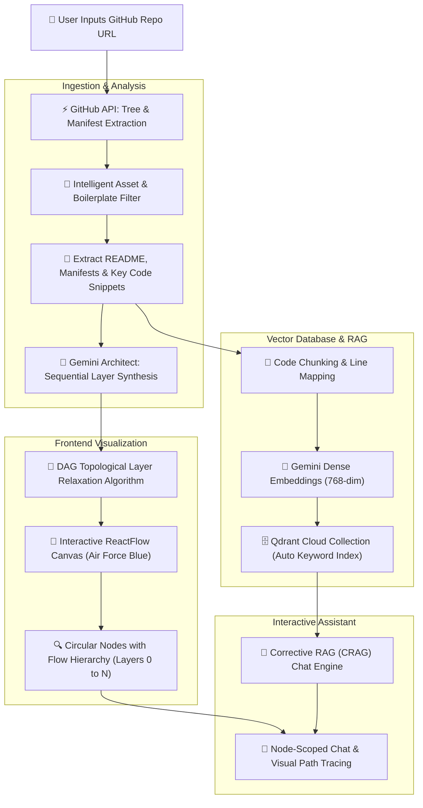

# RepoGraph AI ⚡

> *"We are going to show you full flow of your repository like git in a beautiful manner, it's RepoGraph AI"*

**RepoGraph AI** is an intelligent developer tool that transforms any GitHub repository into an interactive, beautifully ordered architectural flow diagram. Powered by Gemini LLMs, Qdrant Cloud Vector Search, and ReactFlow, RepoGraph AI visualizes the true runtime execution and data flow of codebases while providing context-grounded AI assistance.

---

## 🌊 How It Works: The End-to-End Flow



---

## 🔄 Step-by-Step Architecture Pipeline

### 1. Intelligent Repository Ingestion
- Accepts any public GitHub URL (e.g. `https://github.com/username/repository`).
- Recursively inspects the file tree via GitHub's Git Trees API.
- Automatically strips non-code bloat: binary assets (`.png`, `.jpg`, `.pdf`, `.zip`), build outputs (`dist/`, `build/`), dependency caches (`node_modules/`, `vendor/`), and platform-specific asset directories (`android/.../res/`, `ios/Pods/`).
- Prioritizes foundational files:
  - **Documentation**: `README.md` for architecture, tech stack, and intent.
  - **Manifests**: `package.json`, `pubspec.yaml`, `requirements.txt`, `pyproject.toml`, `Cargo.toml`, `go.mod`.
  - **Entrypoints**: `main.*`, `app.*`, `index.*`, `server.*`.
  - **Core Modules**: Controllers, services, routers, models, and stores.

### 2. Sequential Layer Synthesis with Gemini
- An LLM software architect analyzes the filtered tree, dependencies, and code snippets.
- Structures components into strict sequential depth layers:
  - **Layer 0 (Entrypoint & UI)**: Client UI, screens, mobile views, CLI commands, HTTP entry gates.
  - **Layer 1 (Dispatchers & Routing)**: State controllers, BLoCs, providers, API routers, middleware.
  - **Layer 2 (Core Business Logic)**: Domain services, algorithms, AI inference pipelines, processing engines.
  - **Layer 3+ (Persistence & Integrations)**: Databases (SQLite, PostgreSQL, Firestore), caches, external APIs.
- Generates directed edges `(source -> target)` with informative action verbs describing data transfer or invocation.

### 3. Vector Embeddings & Corrective RAG (CRAG)
- Code files are segmented into overlapping chunks with precise line tracking (`file:start_line-end_line`).
- Embeddings are generated with `gemini-embedding-001` (768 dimensions).
- Ingests chunks into Qdrant Cloud with an automatic keyword index on the `file` attribute for fast scoped filtering.
- General repository architectural questions are answered using global synthesized context, while scoped node queries leverage vector similarity with automatic web fallback when needed.

### 4. DAG Topological Flow Canvas
- The frontend computes vertical and horizontal coordinates using a **DAG topological layer relaxation algorithm**:
  - Guarantees downstream target nodes are placed strictly below their parent source nodes (`layer(target) > layer(source)`).
  - Positions each tier symmetrically with generous breathing room (`290px` horizontal, `230px` vertical) to prevent edge crisscrossing.
  - Renders custom circular hub nodes with frosted glassmorphism, Air Force Blue selection rings, step badges, and smooth downward bezier curves with interaction labels.

### 5. Context-Scoped Chat & Visual Flow Tracing
- Clicking any node opens a scoped chat tab focused exclusively on that component's files.
- Clicking **Trace Flow** highlights the exact step-by-step execution path across the canvas, visually dimming non-relevant nodes.
- Saved repositories are preserved in browser storage and accessible via a slide-over sidebar with instant search and 1-click workspace opening.

---

## 🛠️ Tech Stack

### Frontend
- **Framework**: [React 19](https://react.dev/) + [Vite](https://vitejs.dev/)
- **Graph Canvas**: [@xyflow/react](https://reactflow.dev/) (ReactFlow v12)
- **Styling**: [Tailwind CSS](https://tailwindcss.com/) (Air Force Blue `#4789b8` palette, Dark/Light modes)
- **State Management**: [Zustand](https://github.com/pmndrs/zustand)
- **Icons**: [Lucide React](https://lucide.dev/)
- **Typography**: Poppins & JetBrains Mono

### Backend
- **Framework**: [FastAPI](https://fastapi.tiangolo.com/) + [Uvicorn](https://www.uvicorn.org/)
- **LLM & Embeddings**: Google GenAI SDK (`gemini-3.5-flash-lite`, `gemini-embedding-001`)
- **Vector Database**: [Qdrant Cloud](https://qdrant.tech/) (Dense vectors + Keyword payload indexes)
- **HTTP Client**: [HTTPX](https://www.python-httpx.org/) (Async connection pooling)

---

## 🚀 Getting Started

### Prerequisites
- Node.js (v18+)
- Python (v3.10+)
- Gemini API Key ([Google AI Studio](https://aistudio.google.com/))
- Qdrant Cloud Cluster URL & API Key ([Qdrant Cloud](https://cloud.qdrant.io/))

### Frontend Setup

```bash
# Navigate to frontend directory
cd frontend

# Install dependencies
npm install

# Start development server
npm run dev

# Build for production
npm run build
```

### Backend Setup

```bash
# Navigate to backend directory
cd backend

# Create virtual environment
python -m venv venv
.\venv\Scripts\activate  # Windows
# source venv/bin/activate  # macOS/Linux

# Install dependencies
pip install -r requirements.txt

# Configure environment (.env)
# GEMINI_API_KEY=your_key
# QDRANT_URL=https://your-cluster.qdrant.io:6333
# QDRANT_API_KEY=your_key

# Start backend server
python -m uvicorn main:app --reload
```

---

## 📄 License
MIT © [Inderjeet Singh](https://github.com/inderjeet20)
